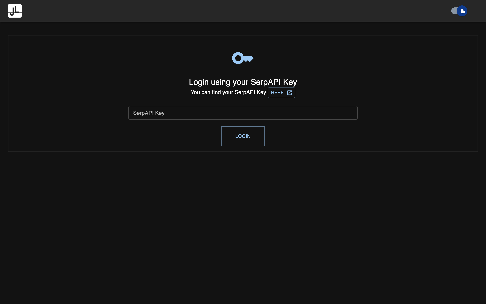
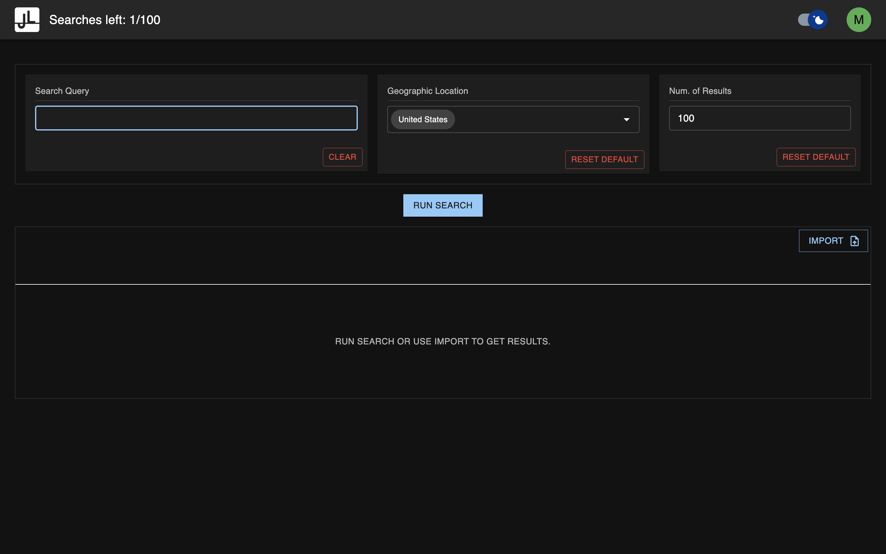
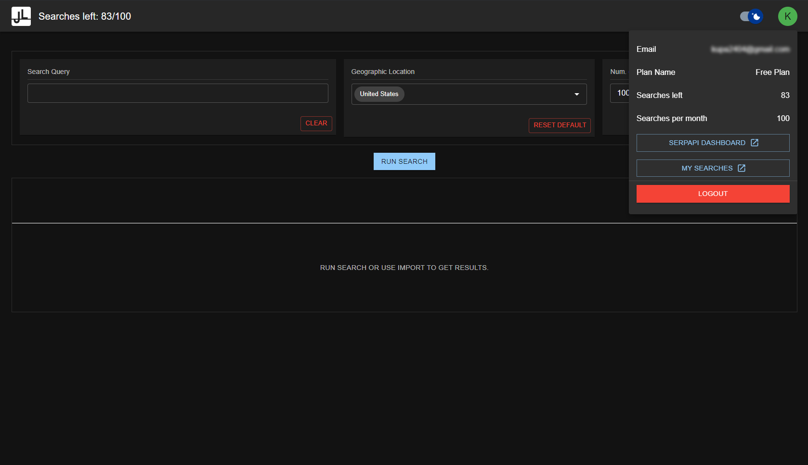
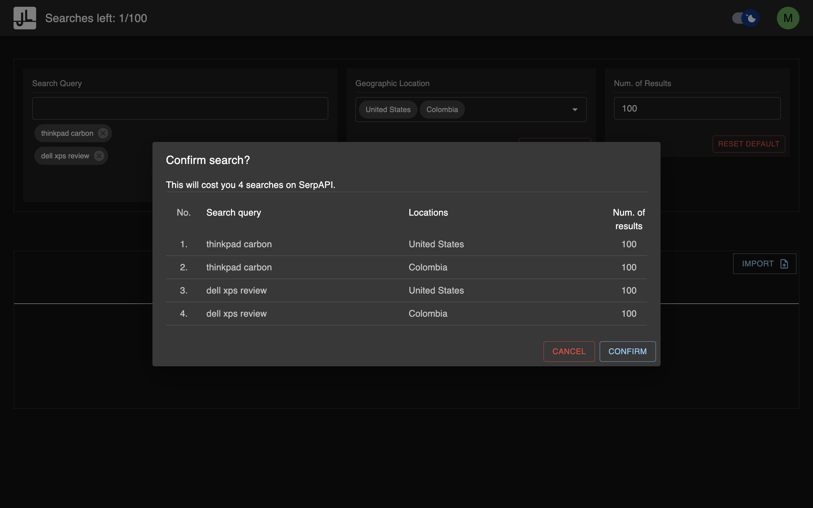
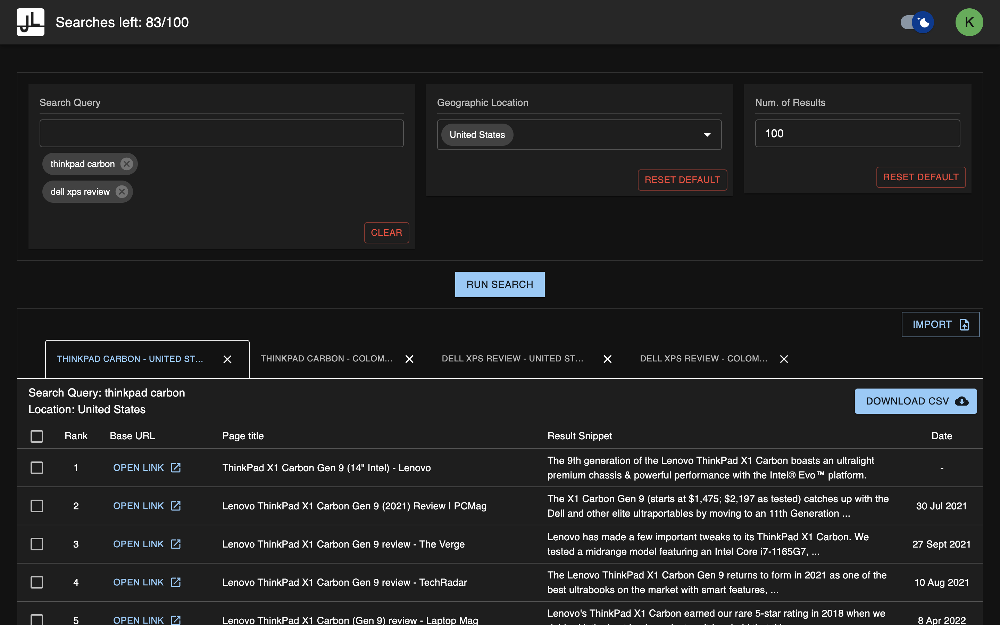
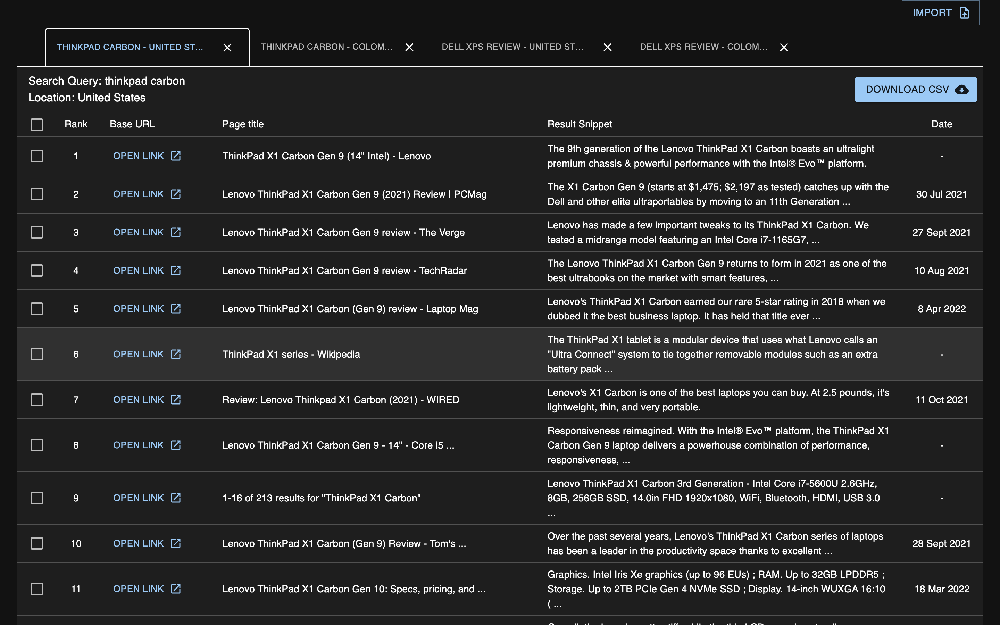
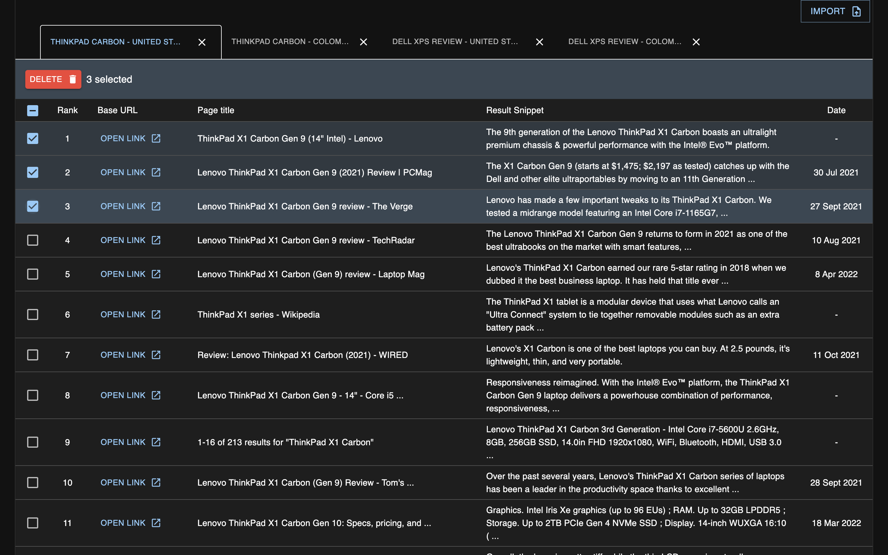

# JL 1.0

- [About](#about)
- [Architecture](#architecture)
- [Demo](#demo)
- [Features](#features)
- [Pages](#pages)
- [FAQ](#faq)

## About

Goal of JL1.0 is to make interaction with Serp API easier and makes gathering information much more convenient. JL1.0 allows you to conduct many searches at the same time as oposed to going to google and doing searches manually one by one and writing notes in some document. Alternatively, you could use SerpAPI dashboard for research, but consuming JSON information the way they present it is not convenient for everyone. JL1.0 will present search data in a table that is easy to consume. JL1.0 will also let you export your searches into a csv(comma separated values) file that you can save for later, or open in excel.

## Demo

GIF

## Architecture

This application is developed using:

- [Electron](https://www.electronjs.org/)
- [React](https://reactjs.org/)
- [MaterialUI](https://mui.com/)
- [Express](https://expressjs.com/)

Electron is a framework for developing cross-platform desktop applications. Therefore this app does not require to be deployed anywhere, thus no server cost at all. The app will run on your computer.

Suported operating systems: `Windows`, `Linux`, `MacOS`.

UI is written using React and MaterialUI.

There is a small, basic express server that plays the role of a proxy when interacting with SerpAPI. The express server runs on port 3000.

## Features

- [Login Form](#login-form)
- [Homepage](#Homepage)

## FAQ

1. Where can I find my Serp API key?
2. Are my searches stored in database?
3.

# Pages

There are basically only two pages in this app, the Login page and the Homepage. Homepage contains pretty much all the features that JL1.0 offers. Below are descriptions of pages and their resposibilities.

Here is list of components in JL1.0:

- [Login Form](#login-form)
- [Homepage](#Homepage)

## Login Form

To login into JL1.0 you need to use private API key provided from the SerpAPI.
You can find your API key [here](https://serpapi.com/manage-api-key).

## Homepage

This is the main page of the app. Here you can:

- conduct searches
- read results in table
- delete results
- import results from previous searches
- download results as a .csv file.

## User Menu

User menu has some useful information about the user. The menu shows informations such as:

- Users email
- Name of the plan on SerpAPI
- Searches left in this month
- Searches per month according to plan on SerpAPI

and offers link to useful pages on SerpAPI such as:

- SerpAPI dashboard
- My Searches page on SerpAPI

and of course the `LOGOUT` button.

## Confirming search

Before runing any search, the app will ask you to review and confirm searches before running them. The modal will popup showing you all the searches that you are about to run as well as how much this will cost you in terms of searches on SerpAPI.

## Conducting search

Once you confirm to run a search, search will be conducted and the results will be presented in tables below. Each search will be in it's own tab for you to navigate.

## Search results

## Deleting results

Apart from just reading the results you are able to remove some of the results if you wish.

